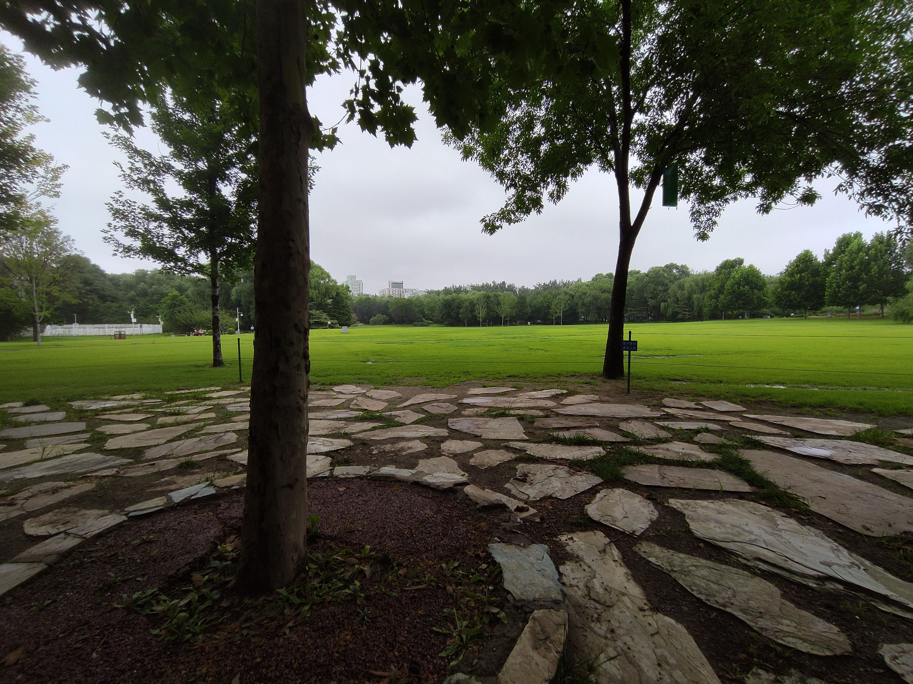

早上去森林里走走是个好习惯，可惜去年坚持了一段时间后就放弃了，可能有几个原因：
- 相比直接去上班增加了距离，骑车会消耗更多体力
- 作息不健康，起得比较晚，没时间出去
- 有时候没有共享单车（大概）

去年在海淀公园度过了一小段时光，面前是草坪，背后是湖，我在这里看书、发呆、睡觉，快到点了就去公司。也许这么折腾没什么意义，但这让我觉得自己是特别的：拥有不同于别人的生活。

今天早上在家附近的公园转了下，被森林围绕的感觉真好，溜达一圈整个人感觉更健康了。希望能坚持下来这个习惯。
