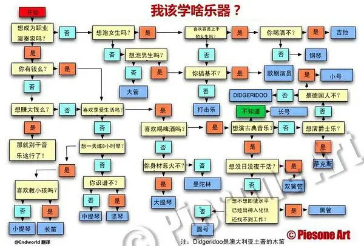

去年买的电子琴只弹了几次，后面就放弃练习了，因为我觉得难度太高，一首曲子都没弹会，这辈子可能都不会再学了。

但今天我又拆开了它的包装，接上了电源。

重拾它的动机来源于昨天看到的一张沙雕图：

想了想适合我的乐器应该就是钢琴/电子琴了，我对吉他不感兴趣，对吹奏的乐器也不感兴趣，之前有了解过一点点钢琴的弹奏方法，再加上之前练习过双拼，我想类似键盘的电子琴还是最适合我的。

既然上次失败了，那得好好总结一下失败原因，我认为原因有以下几点：
- 没能完整弹出一首曲子，挫败感很强
- 采用了错误的练习方式，背按键顺序、听音盲猜按键都不适合初学者
- 被繁多、复杂的乐理打击了兴趣
- 客观条件的限制（物理空间及其狭小）

这次有信心坚持的原因：
- 重新看了视频教程，发现教程中给出的练习方法很合理，按照方法练习应该可以看到进步。上次也看了同样的教程，但没太关注练习方法，完全按自己的想法来，正反馈不多，还是怪自己眼高手低。
- 有了学习双拼的经验，知道效率最高的练习方法就是有及时反馈，这次要改变练习方法，关键是把握五线谱和琴键的对应关系，之前完全不看谱弹就离谱。
- 不再追求马上能弹出喜欢的曲子，而是从简单的曲子弹起，一步一步来
- 清楚地认识到弹普通的曲子只需要一点点乐理知识，不懂乐理照样能弹好，减少畏难情绪
