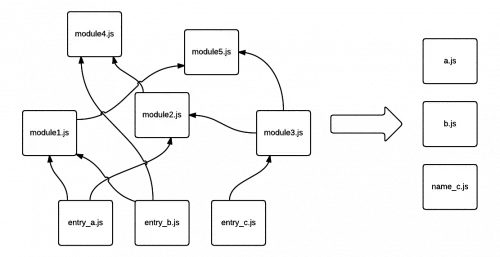

阅读了 https://webpack.docschina.org/concepts/ 相关章节，以下是我的学习笔记

## entry

- entry 指的是 js  
- entry 可有多个（multi entries），下面这张图较容易理解

  
图片来自 [Webpack 101: An introduction to Webpack](https://medium.com/hootsuite-engineering/webpack-101-an-introduction-to-webpack-3f59d21edeba)  

接下来实操一下

目录结构：
```txt
src
  a.js
  b.js
  c.js
  index.html
```

webpack.config.js
```js
const path = require('path');
const HtmlWebpackPlugin = require('html-webpack-plugin');

module.exports = {
  entry: {
    a: path.resolve(__dirname, "src", "a.js"),
    b: path.resolve(__dirname, "src", "b.js"),
    c: path.resolve(__dirname, "src", "c.js"),
  },
  output: {
    filename: '[name].js',
    path: path.resolve(__dirname, 'dist'),
  },
  optimization: {
    // 防止不能 HMR，https://github.com/webpack/webpack-dev-server/issues/2792。其实没太明白，明明没有公共依赖
    runtimeChunk: 'single',
  },
  plugins: [
    new HtmlWebpackPlugin({
      template: path.resolve(__dirname, 'src', 'index.html')
    })
  ],
};
```

打包后结构：
```txt
dist
  a.js
  b.js
  c.js
  index.html
```

dist/index.html
```html
<!DOCTYPE html>
<html lang="en">
<head>
  <meta charset="UTF-8">
  <meta http-equiv="X-UA-Compatible" content="IE=edge">
  <meta name="viewport" content="width=device-width, initial-scale=1.0">
  <title>Document</title>
<script defer src="a.js"></script><script defer src="b.js"></script><script defer src="c.js"></script></head>
<body>
  
</body>
</html>
```

注：
1. 如果有多个页面（多个 html），也可以 [配置多个 entry](https://onestepcode.com/webpack-configuration-multiple-entry-points/)，注意要配多个 new HtmlWebpackPlugin。
2. 在 webpack >= 4 的版本中，建议用 `optimization.splitChunks` 处理 vendor，不要为 vendor 创建 entry。
3. [建议一个 html 只有一个 entry](https://bundlers.tooling.report/code-splitting/multi-entry/#webpack)。  
   由于多个 entry bundles 可能有部分公共代码，可以选择将公共代码提取（extract）成一个 bundle，或者干脆不提取，就打包到每个 bundle 中（inline）。但无论选择哪种方式，都需要注意一个问题：避免重复实例化，重复实例化会造成变量值不同步的问题。webpack code split 的时候，可能会出现多实例的情况，需要配置 `optimization.runtimeChunk: 'single'`  来解决。

## loader

使用方式有 2 种：
1. 写在 webpack.config.js 中，配置在 module.rules 里
2. 在 import 语句中内联（不常用）  

注：
- loader 执行顺序是从后向前（从右向左、从下向上），因为 [loader 是通过函数嵌套方式调用的（洋葱结构）](https://stackoverflow.com/questions/43472333/webpack-2-loaders-declared-in-reverse)
- loader 可以同步，也可以异步

## plugin

plugin 的本质是具有 apply 方法的 JS 对象，webpack compiler 会调用 apply 方法。

```js
const pluginName = 'ConsoleLogOnBuildWebpackPlugin';

class ConsoleLogOnBuildWebpackPlugin {
  apply(compiler) {
    compiler.hooks.run.tap(pluginName, (compilation) => {
      console.log('webpack 构建正在启动！');
    });
  }
}

module.exports = ConsoleLogOnBuildWebpackPlugin;
```

因此在使用 plugin 时需要 new 一个对象。

### html-webpack-plugin 介绍

作用是将 bundle js 插入 html 中，如果 bundle js 名称中有 hash，自动处理会很方便  
另外也可以不使用已有 html（不配置 template），它会自动创建一个 html 并插入 js

```js
plugins: [
	new HtmlWebpackPlugin({
		template: path.resolve(__dirname, 'src', 'index.html')
	})
]
```

## 揭示内部原理

module（即每个文件）-> chunk -> chunk group  
下面这个例子中，有 home 和 about 2 个 chunk group，每个 chunk group 又包含一个 chunk，每个 chunk 包含一个 module（home.js 或 about.js）

```js
module.exports = {
  entry: {
    home: './home.js',
    about: './about.js',
  },
};
```

注：使用 SplitChunksPlugin 可使一个 chunk group 包含多个 chunk

chunk 分为 2 类：
- initial：entry point 对应的 chunk
- non-initial：懒加载的 chunk，如使用了 dynamic import 或 SplitChunksPlugin
