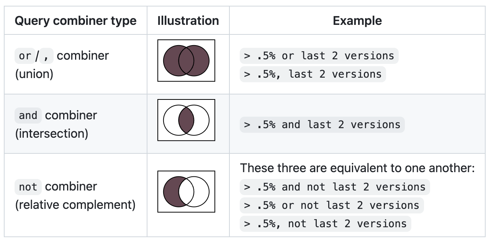

官网：[https://github.com/browserslist/browserslist](https://github.com/browserslist/browserslist)

作用：指定需要兼容浏览器的目标版本，该配置可在不同工具间共享（如 Babel、Autoprefixer）

## 配置规则

配置文件通常写在 package.json 或 .browserslistrc 中

### 官方推荐配置

[Best Practices](https://github.com/browserslist/browserslist#best-practices)

```js
  "browserslist": [
    "defaults"
  ]
```

如果要自定义，建议规则中包含 `last 2 versions, not dead, > 0.2%` 

- `last 2 versions`：最新两个版本的浏览器，防止市场占有率不高而未包括
- `not dead`：排除不再维护或超过 2 年不更新的浏览器
- `> 0.2%`：市场占有率超过 0.2%，包含移动端

注：
- 查询数据的来源是 [caniuse-lite](https://github.com/ben-eb/caniuse-lite)，需要经常执行 `update-browserslist-db` 来更新数据库，保证 `last 2 version` 或 `>1%` 等规则的准确性
- [`not dead` 的位置不同，可能会有不同的结果](https://github.com/browserslist/browserslist/issues/741)，因为 not 只对其左侧的 query 有效，对右侧 query 无效
- [browserslist 作者不建议排除移动端](https://github.com/browserslist/browserslist/issues/579)，没有提供 `not mobile` 这种写法，原因是怕开发者滥用，不考虑移动端群体

### 查询组合

[Query Composition](https://github.com/browserslist/browserslist#query-composition)

通过 `or/,`、`and`、`not` 组合查询，与集合的运算一致



注：
- 换行等同于 `or`
- `not` 不能在没有左值的情况下使用

## 调试

查看当前配置对应的浏览器范围
```bash
npx browserslist
```

检查配置文件是否有写法错误
```bash
npx browserslist-lint
```

另外也可使用 [官方 playground](https://browsersl.ist/) 调试
