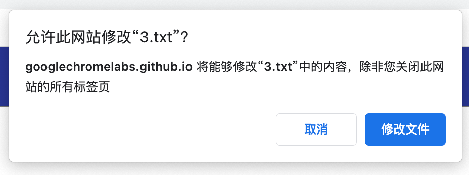
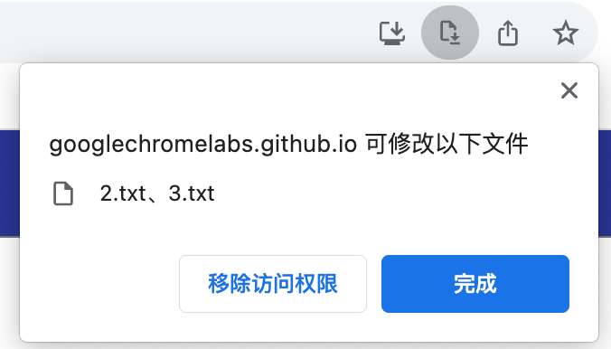

## 介绍

File System Access API 是新提出来的浏览器文件操作 API，相比于 [以前的文件操作方式](https://developer.chrome.com/articles/browser-fs-access/#the-traditional-way-of-dealing-with-files)，优点主要有：
- 代码更加简洁
- 能编辑文件
- 能删除文件
- 能操作文件夹

## 基本使用

首先需要理解 file handle 的概念，可参考 [句柄是什么？](https://www.zhihu.com/question/27656256/answer/943130123)，其实就是操作文件的一个东西（把手、抓手），后面对文件的处理都需要通过 file handle 完成

为了掌握最基本的读、写方法，我仿照 [text-editor](https://github.com/GoogleChromeLabs/text-editor/) 写了一个简单的文本编辑器 [simple-text-editor](https://github.com/today-calm/simple-text-editor)（[点击预览](https://today-calm.github.io/simple-text-editor/)），下面介绍下代码的主要部分

index.html，比较简单

```html
    <header>Untitled.txt</header>
    <button id="new">新建文件</button>
    <button id="open">打开文件</button>
    <button id="save">保存</button>
    <button id="saveAs">另存为</button>
    <br />
    <br />
    <textarea cols="30" rows="10"></textarea>
```

operate.js，对应四种操作

```js
// 作为全局变量，表示当前的文件 handle，在读写时会重复用到
let fileHandle;

// 新建文件
const newFile = () => {
  fileHandle = null;
  setText('');
  setHeader('Untitled.txt');
};

// 打开文件
const openFile = async () => {
  // 选择要打开的文件
  fileHandle = await getFileHandle();
  // 读取文件内容
  const content = await readFile(fileHandle);
  setText(content);
  setHeader(fileHandle.name);
};

// 另存为
const saveAs = async () => {
  // 选择保存位置
  fileHandle = await getNewFileHandle();
  // 写入内容
  await writeFile(fileHandle, getText());
  setHeader(fileHandle.name);
};

// 保存
const save = async () => {
  // 若编辑的不是从本地打开的文件（新建文件），处理方式同“另存为”
  if (!fileHandle) {
    return await saveAs();
  }
  // 若编辑的是从本地打开的文件，则写入内容
  await writeFile(fileHandle, getText());
};
```

fs-helper.js

里面包含了主要的 File System Access Api，如 `showOpenFilePicker`、`showSaveFilePicker`、`createWritable`

```js
const getFileHandle = async () => {
  // 用户在文件选择框内选择文件，返回所有 handle
  const [handle] = await window.showOpenFilePicker();
  return handle;
};

const getNewFileHandle = async () => {
  const options = {
    types: [
      {
        description: '文本类型',
        accept: {
          'text/plain': ['.txt'],
        },
      },
    ],
  };
  // 出现保存文件弹窗，选择保存位置后创建一个新 hanlde
  const handle = await window.showSaveFilePicker(options);
  return handle;
};

const readFile = async (handle) => {
  // 返回 File 对象
  const file = await handle.getFile();
  // 通过 text() 方法，从 blob 中读取文本内容，返回 string
  const content = await file.text();
  return content;
};

const writeFile = async (handle, content) => {
  // 创建 stream，此时会询问用户是否允许页面编辑文件
  const stream = await handle.createWritable();
  // 将内容写入 stream，write 方法接受 string 类型参数
  await stream.write(content);
  // stream 关闭后，改动才写入磁盘
  await stream.close();
};
```

更多用法可参考 [Using the File System Access API](https://developer.chrome.com/articles/file-system-access/#how-to-use)

## 兼容性

该 API 在旧浏览器上可能有兼容性问题，需要 polyfill

[browser-fs-access](https://github.com/GoogleChromeLabs/browser-fs-access) 是谷歌开发者开发的一个库，会优先使用 File System Access API，若浏览器不支持，则 fallback 到旧的文件操作方法

## 安全性

File System Access API 也考虑了安全性：
- 在读取文件时，会让用户选择文件
- 在写入文件时，
    - 若为新文件，则让用户选择保存位置
    - 若文件已存在，则会询问用户是否允许该网站编辑此文件



当用户允许编辑后，之后网页每次覆盖写入该文件都不会再询问用户，直到该网页被关闭

用户也可以随时撤回授权，如下图所示



## 参考资料

- [Reading and writing files and directories with the browser-fs-access library](https://developer.chrome.com/articles/browser-fs-access/#the-file-system-access-api)  
- [The File System Access API: simplifying access to local files](https://developer.chrome.com/articles/file-system-access)  
- [JavaScript File System Access API Tutorial - Read, Write and Save Files](https://www.youtube.com/watch?v=8EcBJV0sOSU)  
- [Text Editor](https://googlechromelabs.github.io/text-editor/)：一个 Demo
- [更强大的文件接口，File System Access API](https://juejin.cn/post/6991277058278047751)
