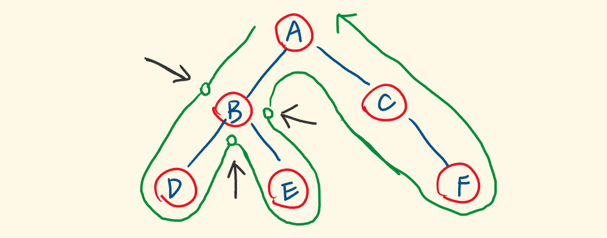

## 正确理解前序、中序、后序和 DFS

这里有一个常见误区，就是以为三种遍历方式遍历节点的顺序不同。三种遍历方式实际上都是先访问根节点，再访问左子树、右子树。我们常说的“根左右”、“左根右”、“左右根”其实是处理节点的顺序，而非遍历节点的顺序。

树中每个节点都会经过 3 次，第 1 次遍历到就处理是前序，第 2 次遍历到再处理是中序，第 3 次遍历到再处理事后序。前中后序本质上都是 DFS。

  
图片来自笨猪爆破组的题解：[谈谈别的，前、中、后序遍历的区别只有一点](https://leetcode.cn/problems/binary-tree-paths/solutions/400428/tu-jie-er-cha-shu-de-suo-you-lu-jing-by-xiao_ben_z/)

## 两种解题思路

由 [104. 二叉树的最大深度](https://leetcode.cn/problems/maximum-depth-of-binary-tree/description/) 题目可引出两种常见的解题思路：
1. 遍历
2. 分解

遍历：简单说，就是在用 DFS 遍历节点的过程中，不断更新外部变量。这种方法需要定义一个新函数，函数的参数中有外部变量（比如 path/sum、res），返回 void。函数的任务是用 DFS 遍历整棵树，一般采用前序遍历，父节点需要将信息（比如 path/sum）传递给子节点，所以信息是自顶向下传递的。

分解：非常递归的一种思考方式，将问题分解为相同的子问题。对于二叉树来说，其实就是把整棵树的问题分解为左子树、右子树的子问题，再合并起来。而这种思路，通常是用后序遍历实现的，因为后序遍历先处理左右子树，再处理根节点，信息是自底向上传递的。这种解法不用定义新函数，使用题目求解的函数作为递归函数即可。为了向上传递信息，函数需要有返回值，但不需要有外部参数。

这两种思路其实很多题解都没有明确区分开，导致让新手很困惑，一会这样写，一会那样写。把两种思维区分开，再看题解就不懵了。

比如 [104. 二叉树的最大深度](https://leetcode.cn/problems/maximum-depth-of-binary-tree/description/)，我们可以自顶向下求深度（根节点到某节点的距离），也可以自底向上获取高度（某节点到叶子结点的距离），两种思路的代码如下
```python
class Solution:
    def maxDepth(self, root: Optional[TreeNode]) -> int:
        # 遍历（前序遍历）
        res = 0

        def dfs(root, level):
            if not root: return
            nonlocal res
            res = max(res, level)
            dfs(root.left, level + 1)
            dfs(root.right, level + 1)
        
        if not root: return 0
        dfs(root, 1)
        return res
```

```python
class Solution:
    def maxDepth(self, root: Optional[TreeNode]) -> int:
        # 分解（后序遍历）
        if not root: return 0
        return 1 + max(self.maxDepth(root.left), self.maxDepth(root.right))
```

再比如 [112. 路径总和](https://leetcode.cn/problems/path-sum/description/)，也可以用两种方法解决
```python
class Solution:
    def hasPathSum(self, root: Optional[TreeNode], targetSum: int) -> bool:
        # 遍历（前序遍历）
        res = False

        def traverse(root, sum):
            nonlocal res
            sum += root.val
            if not root.left and not root.right:
                if sum == targetSum:
                    res = True
                return
            if root.left:
                traverse(root.left, sum)
            if root.right:
                traverse(root.right, sum)
        
        if not root: return False
        traverse(root, 0)
        return res
```

```python
class Solution:
    def hasPathSum(self, root: Optional[TreeNode], targetSum: int) -> bool:
        # 分解（后序遍历）
        if not root: return False
        if not root.left and not root.right:
            return root.val == targetSum
        return self.hasPathSum(root.left, targetSum - root.val) or self.hasPathSum(root.right, targetSum - root.val)
```

## 回溯和遍历的关系

回溯其实就是个暴力算法，通过 DFS（前序遍历）遍历整棵树（不考虑剪枝），只不过这棵树需要根据题意构造出来，叶子结点的位置（终止条件）也需要自行确定。

之前二叉树中的一些问题是用遍历的方式解的，其实暗含了回溯的过程。比如上面 [112. 路径总和](https://leetcode.cn/problems/path-sum/description/) 这道题，在返回上层时，上层 `sum` 的值没有变化（隐含了回溯）。又比如 [257. 二叉树的所有路径](https://leetcode.cn/problems/binary-tree-paths/description/)，下方代码中的 `path.pop()` 就是回溯。
```python
class Solution:
    def binaryTreePaths(self, root: Optional[TreeNode]) -> List[str]:
        res = []
        path = []

        def preorder(root, res, path):
            path.append(root.val)
            if not root.left and not root.right:
                res.append('->'.join(map(str, path)))
                return
            if root.left:
                preorder(root.left, res, path)
                path.pop()
            if root.right:
                preorder(root.right, res, path)
                path.pop()
            
        preorder(root, res, path)
        # 此时 path 是 [1]，不会把第一个元素清空
        return res
```

代码随想录的文章 [回溯算法理论基础](https://www.programmercarl.com/%E5%9B%9E%E6%BA%AF%E7%AE%97%E6%B3%95%E7%90%86%E8%AE%BA%E5%9F%BA%E7%A1%80.html) 给出了回溯的模板，一般回溯问题都能套用该模板。
```c
void backtracking(参数) {
    if (终止条件) {
        存放结果;
        return;
    }

    for (选择：本层集合中元素（树中节点孩子的数量就是集合的大小）) {
        处理节点;
        backtracking(路径，选择列表); // 递归
        回溯，撤销处理结果
    }
}
```

## 参考资料

[运用递归解决树的问题](https://leetcode.cn/leetbook/read/data-structure-binary-tree/xefb4e/)  
[两种解题思路](https://labuladong.github.io/algo/di-ling-zh-bfe1b/dong-ge-da-334dd/#%E4%B8%A4%E7%A7%8D%E8%A7%A3%E9%A2%98%E6%80%9D%E8%B7%AF)（虽然我讨厌作者曾有抄袭行为，但不得不说这篇文章写的还是比较清楚的）  
[二叉树的高度和深度有啥区别？究竟用什么遍历顺序？很多录友搞不懂](https://www.bilibili.com/video/BV1Gd4y1V75u)  
[回溯算法理论基础](https://www.programmercarl.com/%E5%9B%9E%E6%BA%AF%E7%AE%97%E6%B3%95%E7%90%86%E8%AE%BA%E5%9F%BA%E7%A1%80.html)
