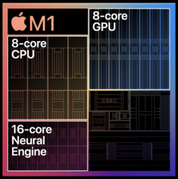
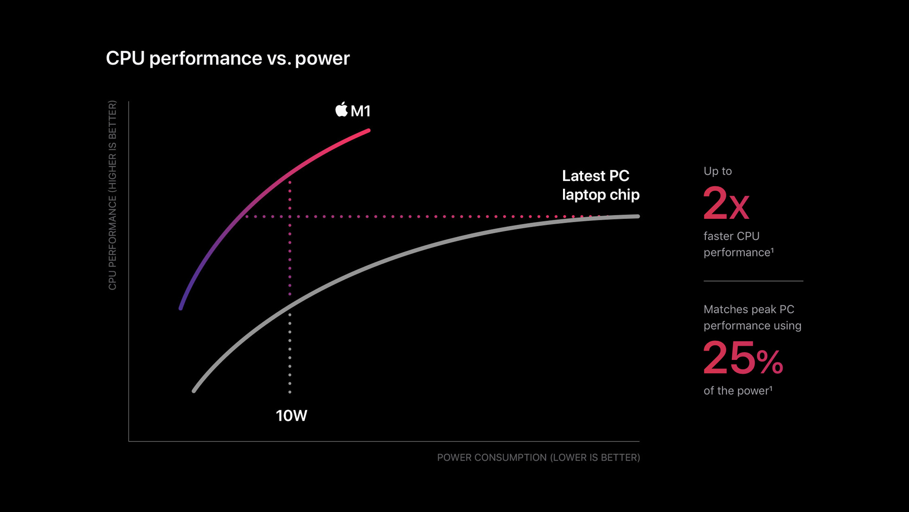

为了了解 M 系列芯片为什么能极其省电、效率极高，又看了一遍 [M1 发布会](https://www.bilibili.com/video/BV1ST4y1F7ze)，在此记录一下发布会中提到的概念

- 单个 SoC 芯片：将多个芯片（CPU、Apple T2、DDR4 memory、Thunderbolt controller）整合到 M1 芯片中
- UMA（Unified Memory Architecture）：M1 封装了高带宽、低延迟的单一内存池，Soc 中的所有技术都能访问相同的数据，无需复制或翻译
- 5 纳米制程：M1 的晶体管数量是 160 亿
- CPU 的两种核心：High-performance cores（性能核心，4 核，承担高负载任务）、High-efficiency cores（能效核心，4 核，用低功耗完成轻型任务）
- Neural Engine（16 核）：每秒能执行 11 trillion（万亿）次计算

感觉最牛的还是 UMA，把多个芯片整合在一起，使用统一数据，大幅减少了不必要的消耗

  
图片来自 [Apple 正式发布 M1 芯片](https://www.apple.com.cn/newsroom/2020/11/apple-unleashes-m1/)
