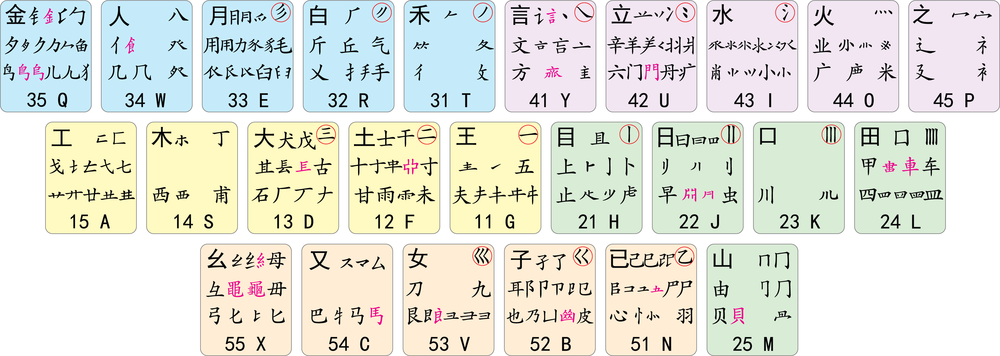
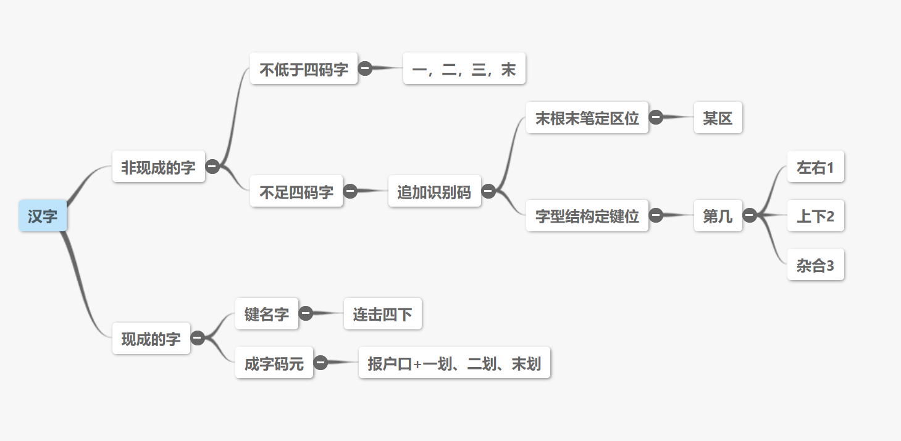

## 五笔版本选择

五笔一共分为 3 个版本：86、98、新世纪  

| 版本   | 特点                                                                                         |
| ------ | -------------------------------------------------------------------------------------------- |
| 86 版  | 用的人最多，各大五笔输入法默认都是 86 版，不存在兼容性问题，但拆字不规范，有些字需要死记硬背 |
| 98 版  | 解决了 86 版拆字不规范的问题，拆字遵守汉字书写顺序，学习起来更容易                           |
| 新世纪 | 不太了解，不少人喷，不推荐                                                                   |

2020 年起 Apple 设备就原生支持三个版本的五笔了，其他平台仍需要下载第三方输入法

为了保持学习兴趣，这里选择 98 五笔学习

## 五笔输入法选择

见 [Mac 五笔输入法的选择](mac五笔输入法的选择.md)

## 理论学习

首先阅读以下教程，需要结合起来看，内容会互补：

[98五笔入门教程](https://www.bilibili.com/video/BV1i441137JH)  
[98五笔字型入门教程](https://github.com/yanhuacuo/98wubi-tables/wiki)  
[五笔字型输入法](https://zh.wikipedia.org/zh-sg/%E4%BA%94%E7%AC%94%E5%AD%97%E5%9E%8B%E8%BE%93%E5%85%A5%E6%B3%95)  
[一个月，五笔从入门到进阶](https://sspai.com/post/71520)  
[五笔7天速成](https://wubi.yantuz.cn/)  
[五笔小筑](https://wubi98.gitee.io/)  

下面记录重要的理论知识：

### 分区、键位

图片来自 [98wubi-tables/字根图/透明码元图002](https://github.com/yanhuacuo/98wubi-tables/blob/master/%E5%AD%97%E6%A0%B9%E5%9B%BE/%E9%80%8F%E6%98%8E%E7%A0%81%E5%85%83%E5%9B%BE002.png)

五笔将键盘划分为「横、竖、撇、捺、折」五个区，每个区有 5 个按键，各按键从中间向外侧分别编号为「1、2、3、4、5」键位

剩余的按键「z」是学习键，可作为任意键使用

### 字根

根据 [维基百科](https://zh.wikipedia.org/zh-sg/%E4%BA%94%E7%AC%94%E5%AD%97%E5%9E%8B%E8%BE%93%E5%85%A5%E6%B3%95)，98 五笔共有 259 个字根，按每个按键平均 10 个字根算，总共就是 250 个字根左右

部分字根可以变形，例如「乙」，可变形为「ㄋ」、「𠄌」、「乛」、「乚」、「㇉」、「𠃌」等

### 打字规则

在五笔中，汉字被分为 4 类：
- 键名字（各按键左上角的字）
- 成字码元（也叫字根，各按键非键名字的部分）
- 不足四码字
- 不少于四码字

每种类型有对应的打字规则：

图片来自 [98 五笔资源库](http://98wb.ysepan.com/)

识别码：字形结构分为 3 种（下节会详细讲解），左右型键位为 1，上下型键位为 2，杂合型键位为 3。因此识别码就是字根图中右上角有红圈的按键

补码：有 3 个码元在打字时需要加上补码，这 3 个码元是「犭」、「礻」、「衤」，这是为了降低重码率

- 带「犭」的字：q + t（部首的末笔是撇）+ 下一笔 + 末笔
- 带「礻」的字：p + y（部首的末笔是点）+ 下一笔 + 末笔
- 带「衤」的字：p + u（部首的末笔是两点）+ 下一笔 + 末笔

特殊末笔：
- 包含「辶」、「廴」、「囗」的字，不取这些偏旁的末笔，而取被包围文字的末笔，也是为了降低重码率
- 「车」作为单字时，末笔为竖，但作为偏旁时，末笔为提。「牛」也是类似的，不过作为偏旁时有专门的字根「牜」。详见 [变横为提的车与牛](https://wubi98.gitee.io/2021/05/31/2021-05-31-036.98wb/)

### 字形结构、拆字原则

字形结构分为 3 种：左右型、上下型、杂合型

注：
- 划分结构的标准是字根的组合方式，而非直观感受
- 单笔画与其他字根相连时，看作杂合型，例如「下」、「天」
- 「有」、「看」等半包围结构视为上下型，「原」、「层」视为杂合型

拆字原则：
- 能散不连
- 兼顾直观
- 能连不交
- 取大优先

注：
- 某些字可能有好几种拆法，如「来」字，98 五笔引入了字源规则来规范拆法，详见 [关于「来」字](https://wubi98.gitee.io/2019/05/21/2019-05-21-006.98chr/)

### 简码

一级简码：25 个常用字只需一次按键即可打出，部分字与全码第一位不同

| 分区 | 按键 1 | 按键 2 | 按键 3 | 按键 4 | 按键 5 |
| ---- | ------ | ------ | ------ | ------ | ------ |
| 横   | g：一  | f：地  | d：在  | s：要  | a：工  |
| 竖   | h：上  | j：是  | k：中  | l：国  | m：同  |
| 撇   | t：和  | r：的  | e：有  | w：人  | q：我  |
| 捺   | y：主  | u：产  | i：不  | o：为  | p：这  |
| 折   | n：民  | b：了  | v：发  | c：以  | x：经  | 

二级简码、三级简码：对应全码的前两位、前三位，无需记忆

### 词组

两字词：第一字的前 2 位编码 + 第二字的前 2 位编码（2 + 2）

三字词：第一字的第 1 位编码 + 第二字的第 1 位编码 + 第三字的前 2 位编码（1 + 1 + 2）

不少于四字词：第一字的第 1 位编码 + 第二字的第 1 位编码 + 第三字的第 1 位编码 + 末字的第 1 位编码（1 + 1 + 1 + 1）

## 练习方法

### 熟悉码元对应键盘位置

[五笔练习游戏](https://github.com/today-calm/WubiGame/tree/feat/add-98-version)（fork 仓库后，增加了 98 版本练习）

或者通过虚拟机安装 Windows 版金山打字通，有点麻烦，未尝试

### 练习常用 1500 字

根据 [常用6763个汉字使用频率表](https://github.com/sxei/pinyinjs/blob/master/other/%E5%B8%B8%E7%94%A86763%E4%B8%AA%E6%B1%89%E5%AD%97%E4%BD%BF%E7%94%A8%E9%A2%91%E7%8E%87%E8%A1%A8.txt)，练习常用 1500 字即可覆盖绝大多数情况

使用 [玫枫跟打器](https://kylebing.cn/tools/typepad/) 练习  

| 字数 | 覆盖率（%） | 
| ---- | ----------- |
| 500  | 78.53202    |
| 1000 | 91.91527    |
| 1500 | 96.47563    |
| 2000 | 98.38765    |
| 2500 | 99.24388    |
| 3000 | 99.63322    |
| 3500 | 99.82015    |
| 4000 | 99.91645    |
| 4500 | 99.96471    |
| 5000 | 99.98633    |
| 5500 | 99.99553    |
| 6000 | 99.99901    |
| 6479 | 100.00000   |
| 6500 | 100.00000   |
| 6763 | 100.00000   |

### 拆字查询

[98wubi-tables/98五笔拆分映射表](https://github.com/yanhuacuo/98wubi-tables/tree/master/98%E4%BA%94%E7%AC%94%E6%8B%86%E5%88%86%E6%98%A0%E5%B0%84%E8%A1%A8)：内含码表、字体。在文本编辑器中查找某字，即会出现对应的码元、五笔编码

[汉字笔顺](http://www.hanzi5.com/)：查询笔画顺序，有助于理解拆字

## 易错字

见 [98 五笔易错字](98五笔易错字.md)
