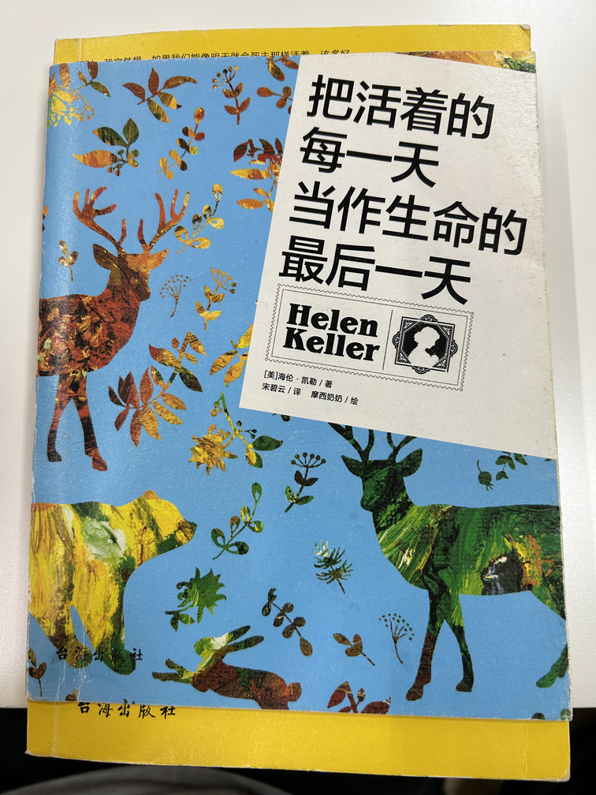

这本书在豆瓣上没找着，是台海出版社出版的

在秦皇岛某书店花了 2h 出头读完了

> 也许人类天性如此，极少去珍惜所拥有的东西，而去渴望那些得不到的东西。在光明的世界中，视觉这一天赋才能，竟只被作为一种便携工具，而不是一种丰富生活的手段！这是多么可惜啊！
> 
> 假如我当上大学校长，我要开设一门必修课程，就是“如何去使用你的眼睛”。教授将教会他的学生，怎样用心去观看那些从他们面前过去而一直被忽略的事物，让他们看到这五彩的世界，体会到这多姿多彩的人生，唤醒他们沉睡已久的天赋。
> 
> 也许我能用想象来告诉大家，假如给我哪怕只有三天的光明，我最想做的一些事情。
> 
> 在我想的时候，也请你想一下吧，请你认真想想这个问题。假定你只剩下三天的光明，那么你会怎样使用你自己的眼睛，你最想让你的目光停留在哪里？自然，我想亲眼看看在我黑暗岁月里令我珍惜的东西，我想你也一样吧。只有这样，你才会在那即将到来的夜晚，将它们牢记。

人总是忽略所拥有的东西，直到失去才后悔莫及

> 我相信各位读者看了前面谈书的章节，不至于断定阅读是我唯一的乐趣。其实我的乐趣和消遣很多，而且千变万化。

后面凯勒介绍了她的多种爱好，实在很丰富，比我这个健康的人的爱好多得多，惭愧啊

> 我没有办法用眼睛看黑板上画的几何图形，要得到清晰的图形概念就得在衬垫上用两端尖尖的直铁丝或弧形铁丝来作图。照着凯伊斯先生课程中的说法，我脑袋里必须装着图形的字母、假设和结论以及作图和证明的过程。换言之，每一种学习都有障碍。有时候，窝勇气尽失，不自觉地泄露出我的心情，个中滋味每每想起就感到羞愧。何况，我困扰的问题事后还被人用来指责莎莉文小姐——虽然我在那边有许多好心的朋友，但她却是唯一可以让曲径变直、让荆棘变坦途的人啊。
> 
> 不过，我的困难一点一点渐渐被消除。凸字版的书和其他器材被送到了，我恢复信心发奋努力。代数和几何是唯一我拼命努力仍弄不懂的学科。以前我就说过，我没有数学天赋，并没有人充分向我解说困难点。几何图形尤其恼人，因为我看不见各部分之间的相关位置，即使在衬垫上也是如此。直到凯伊斯先生来教我，我才对数学有了清晰的概念。

从这段描述中可以看出，学习数学对凯勒来说非常困难

> 任何老师都有办法把小孩带进教室，但不是每个老师都有办法使他学会东西。除非他很自觉，忙闲由他，他有充分的自由，否则他不会高高兴兴地用功的。他必须先感受到胜利的兴奋和失望的灰心，才能自愿地承担他觉得无趣的任务，决心勇敢地忍受教科书的沉闷老套。
> 
> 老是跟我很亲近，我很少单独想到自己而不想起她。我对美丽万物的喜悦，有多少是与生俱来，有多少是受她影响，我自己也弄不清楚。我觉得她的存在与我的存在密不可分，我生命的脚步在她的脚步里。我身上最好的一切都属于她——我没有一项才华、一个灵感或一种快乐不是靠她充满爱的触摸唤醒的。

莎莉文老师是对凯勒影响最大的一个人，将凯勒从寂寞的世界中拉了出来

> 我早就知道周围的人所使用的沟通办法跟我不一样。在我还不知道耳聋的孩子也能学会说话之前，我已经对自己所拥有的沟通媒介深感不足。完全靠手语字母表达的人总是有一种局限感和狭隘感。这种心情使我气恼地感受到一种缺憾，必须加以弥补。我的思绪常常像逆风飞起来的鸟儿鼓动翅膀。我执意使用嘴唇和声音。亲友们怕我失望，尽量泼我冷水要我改变这个念头，但我不屈不挠。过了不久，一件事的发生，终于破除了这项障碍——我听见了娜步·卡达的故事。

听不见却决心学说话，太强了，一定会经历许多曲折

> 富勒小姐的方法如下：她在发声时将我的手轻轻拂过她的面孔，让我摸她的舌头和嘴唇的位置。我一心想模仿每一个动作，一个小时后已学会六个字符：M，P，A，S，T，I。富勒小姐总共给我上了十一堂课。我永远忘不了我发出第一个连贯的句子“It is warm.”时内心的惊喜。不错，虽然只是结结巴巴的破碎音节，但却是人语。我的灵魂感知到了新的力量，挣脱了束缚，正要透过这些破碎的言语符号追求一切知识和信仰。

了不起的成就

> 认识一朵花，连同根、茎等物和它的一切生长过程都了解得清清楚楚，还是很可能不懂得鉴赏沾着露水的鲜花。我一次又一次不耐烦地暗自困惑：“我何必忙着记住这些说明和假设呢？”这些东西在我的思绪中飞来飞去，像失明的鸟儿以无用的翅膀猛拍空气。我不是要反对去透彻了解我们阅读的名著，只是反对在抗议无止境的批注和叫人迷惑的评论。其实，评注只让我们看出一件事：世上的意见跟人数一样多。...
> 
> 不过，有时候我恨不得去掉一半规定要学的东西。因为头脑如果过度劳累，就无法享受它花大代价得来的宝藏了。我想，一天读四、五本语言不同而且题材天差地别的书，必然会让人迷失读书的目的。人紧张兮兮地匆匆阅读，满脑子测验和考试，等于脑袋里堆满许多看起来似乎没什么用处的精致小摆设。目前，我的脑子里装了好多不同类的事，简直没法理出头绪来。每当我进入自己头脑的领域，感觉就像俗谚中所说的“置身于瓷器店的公牛”。无数零星的知识像冰雹在我的脑袋四周冲撞。我想躲，各种主题精灵和大学怪兽对我穷追不舍，我真恨不得——喔，但愿我这邪恶的愿望能得到宽恕——恨不得把我膜拜的偶像们砸个稀巴烂。

没想到她还是一个幽默的人。就算是喜欢读书的她，一直学新东西也会吃不消啊

> 就在这个时候，监考老师通知你时间到了。你带着强烈的不悦把那垃圾知识踢进角落里走回家，一心想着革命性的计划，想废除教授未经受询问者同意就发问的天赋神权。
> 
> 我忽然发觉本章的最后两三页用了一些会让我成为笑柄的修辞方式。啊，这就对了！混合的隐喻在我面前讽笑着，趾高气扬，对饱受冰雹和冷眼攻击的“瓷器店公牛”指指点点，那真是无法分析的物种，让他们讽笑吧。...

又是一段幽默的文字

> 我的人生受限极多，但不是依然在许多关键时刻接触到了美丽世界的生活吗？凡事都有美妙之处，连黑暗和寂静也不例外。我学会了无论身处什么状况都要懂得心满意足。
> 
> 不错，有时候我独自在人生封闭的大门外枯坐等候，寂寥感像寒雾包围着我。门内有光明、有音乐和甜蜜的友谊，我却进不去。沉默无情的命运挡住了我的去路。我恨不得质疑命运之神霸道的诏命。因为我的心仍然狂放不羁、热情洋溢，可是舌头不肯说出涌到唇边的无畏怨言，那些话像未留下的眼泪缩回心里。沉默压着我的灵魂。接着，希望含笑前来，悄悄说：“忘我中自由快乐。”所以我尽量将别人眼中的光明变成我的太阳，别人耳中的音乐变成我的交响曲，别人唇上的微笑变成我的幸福。

她又何尝不是绝望过，但她找到了让自己快乐的方式：把别人的快乐当作自己的快乐

---

下面是书后乔布斯在斯坦福大学演讲的内容：

> 有一点在当时是我没有发现，但是后来却被事实所证明的：那就是被苹果解雇是我迄今为止一生当中所碰到的最好的一件事情。尽管前途未卜，但从头开始的轻松感还是将保持成功的沉重感彻底取代。我开始进入了一个我一生当中最有创造力的时期。
> 
> 在接下来的5年时间里，我重新成立了一家叫NeXT的公司和一家叫Pixar的公司。我还爱上了一位了不起的、将会成为我妻子的女人。Pixar公司推出了世界上第一部用电脑制作的最佳动画长片《玩具总动员》，它现在是全球最成功的动画制作室。后来的一系列变化中，苹果将NeXT收购了，我又回到了苹果公司。我们在NeXT开发的技术成为了苹果重新崛起的核心技术。我和劳伦娜也建立了美满的家庭。
> 
> 我很肯定如果当初苹果没有将我解雇的话，后来这一切都不会发生。良药苦口，但是我认为病人确实是需要这种东西的。有时候生活会给你当头一棒，但是不要灰心。我一直都确信，让我一直坚持下去的动力就是我喜欢做的那些事情。你必须找到你真正爱的东西，这个道理适用于必须找到你真正热爱的工作和爱的人。工作占据生活中的大部分时间，让自己真正满意的唯一办法是做自己认为有意义的工作。做有意义的工作的唯一办法是热爱自己的工作。如果你还没有找到你真正热爱的工作，那就继续寻找，不要半途而废。

被解雇竟成了最好的一件事，而突破这一切困难的源泉就是做热爱的事

> 我的第3个故事与死亡有关。
> 
> 在我17岁那年，我读到了海伦·凯勒的一段话：“如果你把每一天都过得像最后一天，总有一天你会发现你是正确的！”这句话给我留下了深刻的印象，从那时起，33年过去了，我每天早上都会对着镜子问自己：“如果今天是我生命中的最后一天，我还会去做今天我要做的事情吗？”如果每次得到的答案都是“不”，那么我就知道我需要做出一些改变了。
> 
> 在我生命中帮助我做出重大决定的一个原则就是：时刻谨记生命随时都可能会结束。因为所有你对外部的期望，你的自尊，所有对于失败以及困窘的恐惧，在面对着死亡的时候都会消失，你脑海中只会存在你认为真正重要的东西。对于我来说，避免患得患失的最好的办法就是随时要提醒自己，生命随时都可能会结束。你已经一无所有的时候，干吗还不跟随自己的感觉去做事情？

一个确定自己行动方向的方法

> 每个人的时间都是有限的，所以不要把自己的生命浪费在活在别人的意愿当中。不要被偏见束缚住，那样只会让你活在别人的设想中。不要让别人的想法遮盖你自己内心真实的声音。最重要的一点是：要有跟随自己内心的直觉与感觉的勇气。它们已经告诉你你真正想成为什么样的人，其他所有的信息都是第二位的。

要相信直觉的力量，一味地使用逻辑并不能给出幸福的方向
