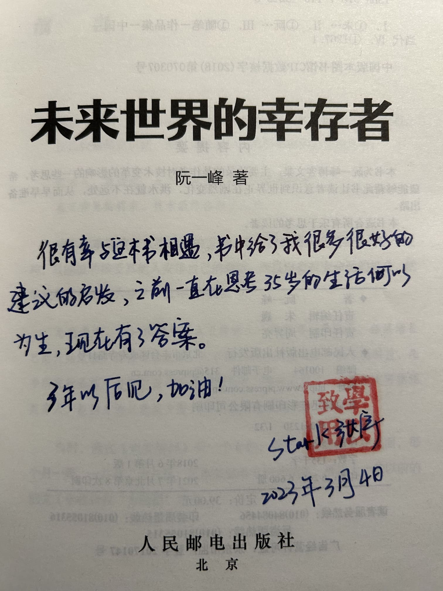

本书作者是阮一峰，这本书只有 160 页，很短，大概是 2016 - 2017 年写的文章。

## 摘录

> 就是因为 B 计划实施起来非常艰苦，所以你最好去做那些你喜欢的事。
> 
> 指定 B 计划的时候，你可以问问自己，如果人生重新开始，你会选择怎样的工作？把这个当做 B 计划的起点。很多人也许会从实际出发，想着如果失去现在的工作，就先在家里休息几天，然后设法在另一家公司里面找到一份类似的工作，再在新的岗位上重整旗鼓。这不算 B 计划，而只是 A 计划的延伸。你最好把 B 计划当成逃离 A 计划的一个机会，借此追求一种梦想中期望的工作。只有这样，你才有最大的动力，忍受 B 计划的艰苦。

> 最后，如果真的到了下决心的那一天，你可能还需要一点勇气。B 计划并不容易，但是提心吊胆地维持一份毫无乐趣、前景灰暗的工作，也是不容易的。

突破当下的限制，需要足够清晰地认识到自己喜欢什么，自己能否在新岗位上保持热情地做下去（需要了解日常的工作流程，不能自以为是），还需要改变的勇气和决心。

> 遭遇挫折，并不是坏事。因为，人生的最终结果是一个极大值函数，而不是一个平均值函数。

> 丘吉尔说过：“所谓成功，就是不停地经历失败，并且始终保持热情。”一次又一次地被拒绝，是你的勇气和进取心的最好证明。它们决定了你可以走多远，把你和那些决心放弃的人拉开差距。

我对极大值函数这个描述深有感触，因为也曾经历过连续的失败，还好最后的结果是好的。当你到达一个高度后，是不会轻易掉下来的，只会往上走。

关于拒绝，又让我想起了贝尔，以及这个网站 [https://rejected.us/](https://rejected.us/)

> 每当你打开一封邮件，你就应该衡量一下，是你自己的事情更重要，还是别人的事情更重要。在现实中，又有多少人能够看到别人的要求，却坚持去做自己的事呢？  
> 如果坚持不住，那么最终你忙忙碌碌的，都是别人的任务，而不是你自己的任务。你的时间到底属于谁？你自己，还是某个给你写信的人？

花自己的时间，做帮助别人完成目标的事情，却不属于自己的工作范围，这种事对自己毫无帮助，是种对时间的浪费。关键是要在自己傻傻去做之前，意识到这一点。

> 为什么你每天早上第一件事是收邮件？答案往往是因为你不知道你该干什么。

> 如果你每天早晨习惯性地打开邮箱，真正的问题倒还不是你浪费了查看邮件的时间，而是你不知道自己的高优先性任务是什么，所以才会去做查看邮件那样的低优先性任务。

如果我在前晚有了今天行动的打算，我会制定行动计划，尽量不浪费时间。但其他时候就没有什么想做的事，可能就会先刷手机了。嗯，这里说的是休息日的情况。如果是工作的话，第一件事是要想清楚今天的目标是什么，查看消息是次要的。

> 你知道吗，为什么别人期待你尽快做出回复？原因可能是，你总是每天一醒来就回复邮件，你自己造成了别人的期望。你越频繁地查看邮件，人们就越相信你会很快地回复。你不再每天早早地查看邮件，人们也就不会再期望你会尽快回复了。

说的就是从前的我，当然现在也总是忍不住看别人发的消息，确实需要改变一下工作习惯，可以尝试设置固定查看消息的间隔，例如 30 分钟。
